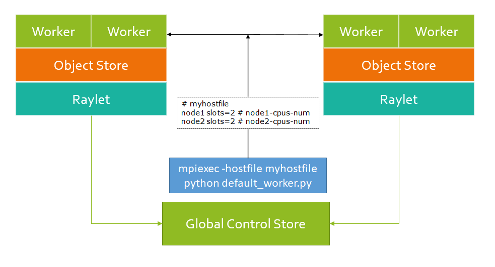

# RFC-202011-MPIEXEC-support

| Status        | Proposed      |
:-------------- |:---------------------------------------------------- |
| **Author(s)** | Hao Zhang, Runhui Huang |
| **Sponsor**   | Ion Stoica, Melih Elibol                 |
| **Reviewer**  | |
| **Updated**   | YYYY-MM-DD                                           |


## Objective

This RFC proposes to add the `mpiexec` support for [MPI](https://github.com/mpi4py/mpi4py) backend in [RFC-20201119-collective-in-ray](https://github.com/ray-project/RFC/blob/main/rfc-20201119-collective-in-ray/20201119-collective-in-ray.md).


## User Benefit

With this project, Ray users can access a set of readily available collective and send/recv APIs in pure Python, with MPI as the backend, supporting CPU in both Numpy and PyTorch.


## Design Proposal

Using `mpiexec` command to start all default workers at the same time, let raylets connect to these default workers. When MPI launches all default workers, we need to skip the original method of launching default workers.

### Where can we execute `mpiexec` command?

#### Architecture

The number of default workers on each node depends on the number of CPU cores, so that we can use `mpiexec` to create the sufficient default workers. `mpiexec` can be executed at the same aspect as `Global Control Store`, and create the needed default workers before raylets created.

The position to execute `mpiexec` is shown below:

<p align="center"></p>

#### Position in code

- The execution of `mpiexec` command can be placed in `python\ray\_private\services.py`. This file launches many services, such as `start_plasma_store`, `start_gcs_server`, `start_raylet`. But the default workers are launched in `src\ray\raylet\worker_pool.cc`
- The python command to launch default worker in C file might add extra parameters, i.e., `--code-search-path=`. We need to find out the situation when the python command needs this extra parameter.

### How to connect the default workers launched by `mpiexec` command?

At first, the job of launching default workers belongs to raylet. When using `mpiexec`, we need to ensure no impact on the other parts. So we need to figure out what else raylet does when launching default workers?

#### What else raylet does when launching default workers?
In `src/ray/ralet/worker_pool.cc`, `Process WorkerPool::StartWorkerProcess` is used to start up one worker process. Except for start the process, raylet does three things:
- recording the time of starting up process.
    ```python
    auto start = std::chrono::high_resolution_clock::now();
    Process proc = StartProcess(worker_command_args, env);
    auto end = std::chrono::high_resolution_clock::now();
    auto duration = std::chrono::duration_cast<std::chrono::milliseconds>(end - start);
    stats::ProcessStartupTimeMs.Record(duration.count());
    ```
- monitoring the worker process, whether worker process register to raylet within the timeout.
    ```python
    MonitorStartingWorkerProcess(proc, language, worker_type);
    ```
- saving the process object and the number of workers.
    ```python
    state.starting_worker_processes.emplace(proc, workers_to_start);
    ```
We can find that these things all need the object of class `Process`. So our goal is changed to obtain the `Process` object of the worker started up by `mpiexec`.

In `Process WorkerPool::StartProcess`, the `Process` object is instantiated. The object containes two variables, one is pid, the other is the file descriptor which is a pipe, used to communicate between the parent process and child process, to obtain the pid. This code is located in `src/ray/util/process.cc`. Now we need to collect the pids of the workers started up by `mpiexec`.

#### How to collect the pids of all the workers launched by `mpiexec`?

After launching the default workers, these workers are in a group. So we can use collective communication method, `gather`, to collect the pids.

We use the `Accept` and `Connect` methods in MPI to create intre-communicator between workers and GCS. GCS collects the pids and sends pids to raylets as the parameters.

But here comes a problem: how can we sent the pids that are on the same machine as raylet?

When raylet gets the pids of default workers, it doesn't need to start up workers by itself. But in `src/ray/raylet/worker_pool.cc` we still need to maintain the others services that we mentioned above.

#### How to make users be able to call the collective communication methods?

The users are only able to manipulate the worker that is assigned to the task. But not all the workers are assigned to tasks. So when assigning workers to tasks, we need to send message to those workers and create a new communicator by calling [`MPI_Comm_split`](https://www.open-mpi.org/doc/v3.0/man3/MPI_Comm_split.3.php). After that, when users call the collective communication methods, such as `ray.collective.allreduce`, the backend will use the new communicator to call MPI APIs.


### Unsolved Problems

...

### Other Considerations

...

